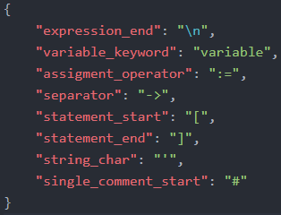
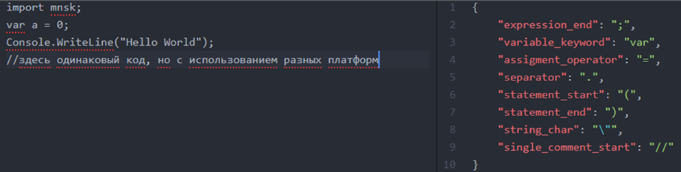
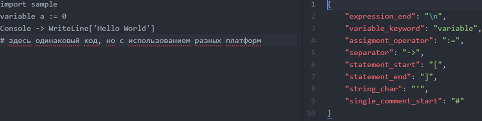

# Mino
 Mino compiler. Need
 * [Tangara](https://github.com/snaulX/Tangara) - official parser of Mino. Frontend of Mino.
 * [TokensBuilder.NET](https://github.com/snaulX/TokensBuilder.NET) - compiler to CIL. Backend of Mino for .NET.
 **Now compiler works only on Windows (.NET Framework 4.5)**
## How to compile & run programs on Mino
For compile&run programs on Mino, use *run.bat*. Open command line in this folder and type `run program1`. You can see how *program1.mino* was compiled and runned. You can see working program on Mino. If you wanna create own program on Mino:
 * Create text file in this folder with *.mino* extension
 * Write some code
 * Open cmd in this folder and write `run YourFileNameWithoutExtension` and if you make all right - you can see own working program on Mino
 * Great! You write own first program on Mino programming language
# Syntax
Main feature of this programming language is **You can change syntax**. The syntax can be changed by creating and using platforms (dialects).
## How it work
> **A platform (or dialect) in Mino** is a JSON (in the future it can be both XML and YAML) a file representing a dictionary, in which the key is the name of the replacement keyword or operator, and the value is a string (word or sign, or several characters ), which will denote this token in the program.  
  
*This is example of small platform*

For example check two different programs and linked to two different platforms:

  
However, they will be compiled into the same tokens. So how does it work? On the left are simple platforms that resemble dictionaries. The key in them is the name of the token, and the value is the token that will be converted to this token. To demonstrate how this works, let's look at the third line of both platforms, which describes a token called *variable_keyword*, which is responsible for starting variable declaration(s). In the first case, we "told" the compiler that we will declare variables with the *var* keyword, and in the second - *variable*. Thus, during parsing, the parser, when it checks the token with the value that we set in the platform, will write the token that we set for this token.
## Base syntax (without platforms)
This syntax duplicate in platform [std](https://github.com/snaulXg/Mino/blob/master/platforms/std.json)
## Sample programs
Always working sample you can watch in -> [program1.mino](https://github.com/snaulX/Mino/blob/master/program.mino).
Also you can find working examples in -> [examples folder](https://github.com/snaulX/Mino/tree/master/examples)
### Programs for future *working* compiler of Mino
**Hello World**
```cs
lib standard;
println("Hello World");
```
**Loops**
```cs
lib standard;
do {
    print("Enter word 'hello': ");
} while (input() != "hello");
var a = 0.0;
while ((a^10) > 100) {
    println("Enter the number that equals 100 to the power of 10");
    try {
        a = input() to double; // in the standard library, the ability to explicitly convert from string type to any numeric type
        // without functions by the parseInt type has been created
    } catch (NumberFormatException) {
        println("You enter not number. Break loop");
        break;
    }
}
for (int i = 0; i < 200; i++) {
    println(i);
}
/*
for (counter i = 0; i < 100000000; i.inc() /*i++*/) {
    println(i/1000); //counter is a special number type in TokensStandard library which optimize use of memory
}
*/
var names = ["Alisa", "Alexander", "Maxim", "Anna", "Michael", "John"];
foreach (string name in names) { // you can replace 'string' by 'var'
    println("Hello $name");
}
```

**Very simple class**
```cs
lib standard;

class MyClass {
    private final var name = "Alexander";

    fun printName() {
        println(name);
    }

    static var int age = 20;

    static fun printSqrOfAge() {
        println(age^2);
    }
}
```

**Template of script for Unity game**
```cs
include UnityEngine.dll;

//lib standard;

use UnityEngine;

class MyScript : MonoBehaviour {
    fun Start() {
        Debug.Log("Script was started");
    }

    fun Update() {
        Debug.Log("New frame");
    }
}
```
